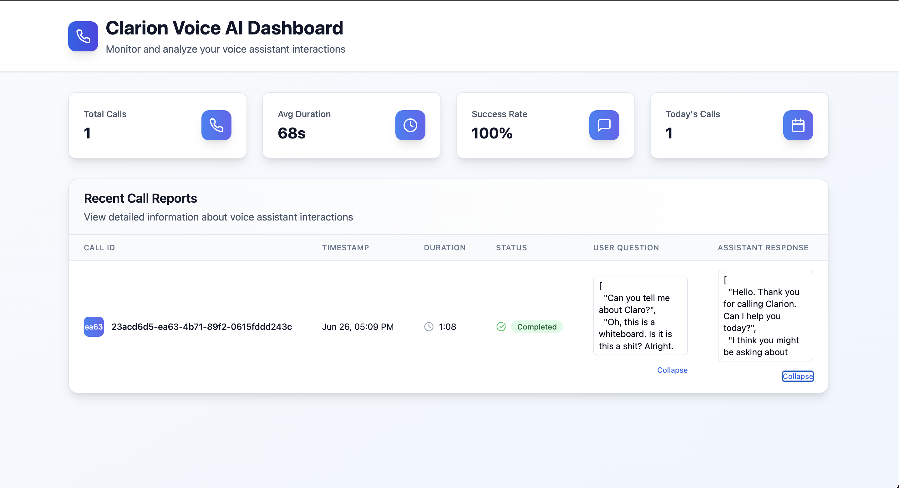

# Clarion Voice AI Dashboard



## Objective
Create a voice assistant that answers questions about Clarion, persists end-of-call reports via a Nest.js backend, and surfaces insights in a React dashboard.  The assistant also leverages a Vapi knowledge-base for extended FAQs.

---

## Stack

| Layer   | Tech                       | Notes |
|---------|----------------------------|-------|
| Voice   | **Vapi**                  | Generative voice AI (phone in/out, reports) |
| Backend | **Nest.js**               | REST API, in-memory storage of reports |
| Frontend| **React + Vite + Tailwind**| Dashboard UI & stats |

---

## Repository Layout

```
ClarionProject/
  backend/   # Nest.js application – REST API
  frontend/  # React dashboard – Vite workspace
```

### Key Endpoints

| Method | Route               | Purpose                            |
|--------|---------------------|------------------------------------|
| POST   | `/call-reports`     | Receive & store a Vapi end-of-call report |
| GET    | `/call-reports`     | Retrieve all stored reports        |

> ℹ️  Reports are kept **in memory** for demo purposes; swap in a database for production.

---

## Quick-start

1. **Install deps** (root folder):
   ```bash
   npm install && cd backend && npm install && cd ../frontend && npm install
   ```
2. **Run backend** (Nest.js, port `3000`):
   ```bash
   cd backend
   npm run start:dev
   ```
3. **Run frontend** (Vite dev server, port `5173`):
   ```bash
   cd frontend
   npm run dev
   ```
4. **Configure Vapi webhook** to point at `http://<ngrok|cloudflared-tunnel>/call-reports` so reports reach the backend.

---

## Features

### 1 – Voice Assistant (Vapi)
* Answers at least **5 core Clarion FAQs** via prompt-engineering.
* Uses a **Vapi knowledge base** for 10+ extended questions.
* Sends **`end-of-call-report`** webhooks containing:
  * call metadata (id, duration, costs…)
  * full transcript
  * messages array

### 2 – Nest.js Backend
* Accepts both envelope & legacy flat webhook payloads.
* Enriches reports with:
  * computed `duration`
  * grouped `conversation.user / assistant` arrays
* Provides a simple in-memory repository.

### 3 – React Dashboard
* Live fetch via **@tanstack/react-query**.
* Stats cards (total calls, avg duration, success rate, etc.).
* Table with expandable JSON cells for *User Question* & *Assistant Response*.

### 4 – Bonus Ideas (not required but scaffold-ready)
* Tool-calling endpoint for **appointment scheduling**.
* Outbound-call initiation via a backend route that triggers Vapi.

---

## Development Notes

* **Cursor** IDE recommended/mandated for the assignment.
* Source code follows latest standards (TypeScript, ES2023, Tailwind v3).
* All components are written in *kebab-case* filenames as per style guide.

---

## License
MIT – feel free to adapt for your own voice-AI demos.
